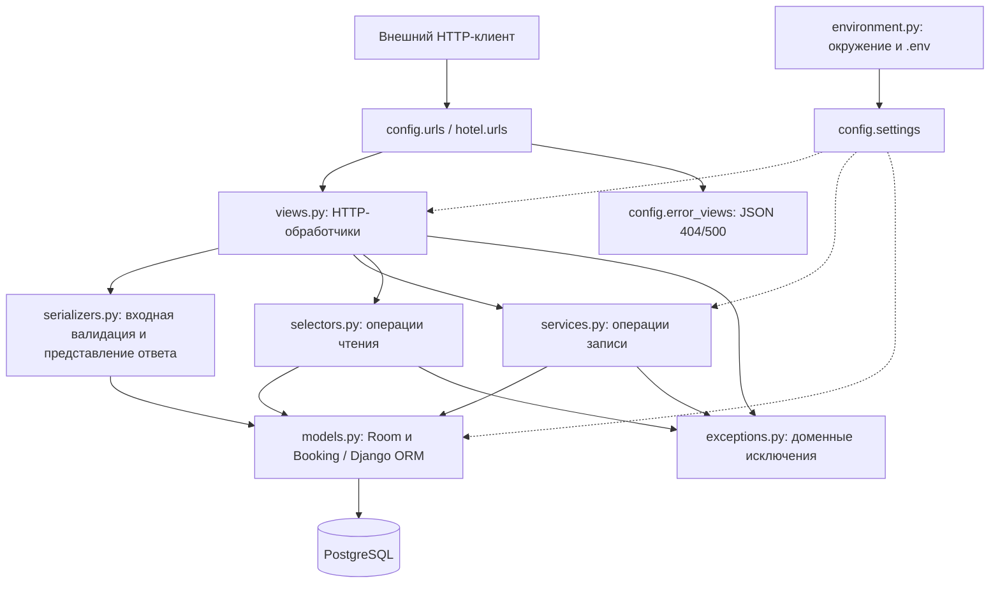
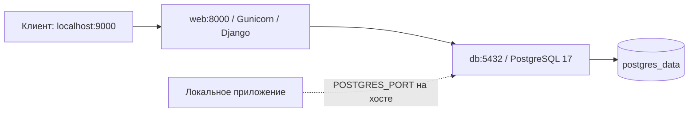

# Компонентная модель

## Состав и зависимости

Стрелки показывают направление вызова или использования компонента.
Схема отражает логические части одного приложения, а не отдельные процессы.



| Компонент | Ответственность | Интерфейс / зависимости |
|---|---|---|
| Маршрутизация | Сопоставление URL обработчику, неизвестные URL | `config.urls` подключает `hotel.urls` и завершающий обработчик 404 |
| HTTP-слой | Приём запроса, запуск валидации, выбор операции, HTTP-код ответа | Шесть представлений наследуют `HotelAPIView` |
| Сериализаторы | Проверка полей, преобразование типов, формирование публичных полей | DRF `Serializer`, `ModelSerializer`, `StrictDateField` |
| Сервисы | Создание и удаление, транзакции, проверка пересечений | `create_room`, `delete_room`, `create_booking`, `delete_booking` |
| Селекторы | Сортированные выборки и проверка существования номера для списка броней | `list_rooms`, `list_room_bookings` |
| Модели | Отображение сущностей в таблицы, связи, ограничения и индексы | Django ORM, `Room`, `Booking` |
| Доменные ошибки | Сигнализация отсутствия объекта или конфликта дат | `RoomNotFoundError`, `BookingNotFoundError`, `BookingOverlapError` |
| Конфигурация | Валидация окружения и настройка Django/DRF/БД | `EnvironmentSettings`, кэшируемая `get_environment()` |
| PostgreSQL | Постоянное хранение, транзакции, блокировки, ограничения | Django PostgreSQL backend и psycopg |

Сервисы и селекторы не формируют HTTP-ответы. Представления преобразуют ожидаемые
доменные исключения в `404` и `409`. `HotelAPIView.handle_exception()` приводит ошибки
DRF к объекту `{"error": "..."}`; неожиданная ошибка внутри представления логируется
и возвращается как `500` с текстом `Internal server error`.

Сериализаторы проверяют входные данные до вызова сервисов. Поэтому непосредственный
вызов сервиса из другого кода должен передавать уже проверенные значения: сервисный
слой не повторяет всю входную валидацию.

## Сценарий создания брони

```mermaid
sequenceDiagram
    participant C as Клиент
    participant V as BookingCreateView
    participant S as BookingCreateSerializer
    participant B as services.create_booking
    participant DB as PostgreSQL
    C->>V: POST /bookings/create
    V->>S: Проверка room_id и дат
    S-->>V: validated_data
    V->>B: create_booking(...)
    B->>DB: BEGIN; SELECT Room FOR UPDATE
    DB-->>B: Номер заблокирован
    opt CHECK_BOOKING_OVERLAPS=true
        B->>DB: Поиск пересечения для этого номера
        DB-->>B: Результат exists()
    end
    alt Пересечение обнаружено
        B->>DB: ROLLBACK
        B-->>V: BookingOverlapError
        V-->>C: 409, объект error
    else Пересечения нет или проверка отключена
        B->>DB: INSERT Booking; COMMIT
        B-->>V: Booking
        V-->>C: 201, объект booking_id
    end
```

Диаграмма показывает запрос с корректными полями и существующим номером.
Ошибка валидации завершает обработку с `400` до вызова сервиса; отсутствие номера
вызывает `RoomNotFoundError`, откат транзакции и ответ `404`.

Интервалы полуоткрытые: `[date_start, date_end)`. Пересечение определяется условием:

```text
existing.date_start < new.date_end AND existing.date_end > new.date_start
```

Выезд одной брони и заезд другой в один день разрешены. Даты в прошлом допустимы.
`transaction.atomic` и `select_for_update()` на строке номера последовательно
выполняют создание броней одного номера, включая проверку и вставку. Разные номера
используют разные блокируемые строки. Блокировка номера применяется даже при
отключённой проверке пересечений.

`delete_room` также блокирует номер в транзакции и удаляет связанные брони через ORM.
`delete_booking` блокирует удаляемую бронь. `create_room` выполняет обычную вставку
без отдельной декорированной транзакции.

## Развёртывание



- Образ `web` основан на Python 3.12; зависимости устанавливаются Poetry.
- Compose ожидает успешного healthcheck БД перед запуском `web`.
- `docker/entrypoint.sh` выполняет `migrate --noinput`, затем запускает Gunicorn
  с тремя worker-процессами и WSGI-приложением `config.wsgi:application`.
- Порт хоста `9000` перенаправляется на `8000` контейнера приложения.
- В сети Compose приложение подключается к `db:5432`. Порт БД на хосте задаётся
  `POSTGRES_PORT`, по умолчанию `5432`.
- Именованный volume `postgres_data` сохраняет данные после обычного `compose down`.
  Удаление volume удаляет и данные.

`EnvironmentSettings` читает корневой `.env` и переменные окружения; окружение имеет
приоритет. `DJANGO_SECRET_KEY` и `POSTGRES_PASSWORD` обязательны. Настройки кэшируются
на процесс, поэтому для применения изменений нужно перезапустить приложение.
По умолчанию класс настроек использует `DJANGO_DEBUG=true`, а Compose при отсутствии
значения подставляет `false`. `CHECK_BOOKING_OVERLAPS` по умолчанию включён.

## Границы гарантий

Запрет пересечений реализован в сервисе, без exclusion constraint в PostgreSQL.
Прямая запись через ORM или SQL в обход `create_booking` может создать пересечение.
При `CHECK_BOOKING_OVERLAPS=false` пересечения намеренно разрешены, но ограничение
порядка дат в БД продолжает действовать. Списки возвращаются целиком без пагинации.
