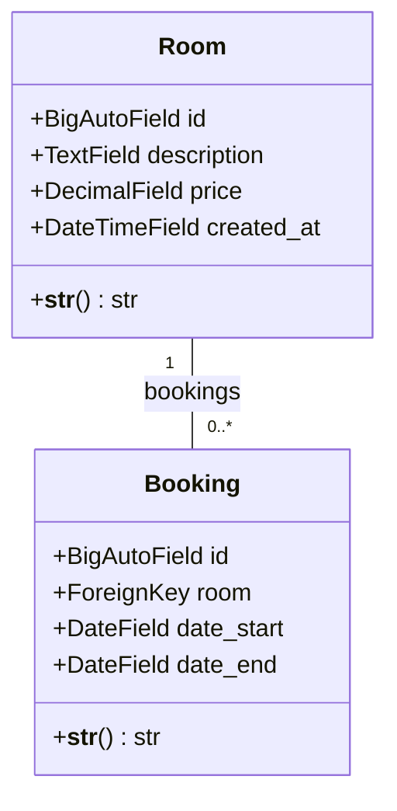
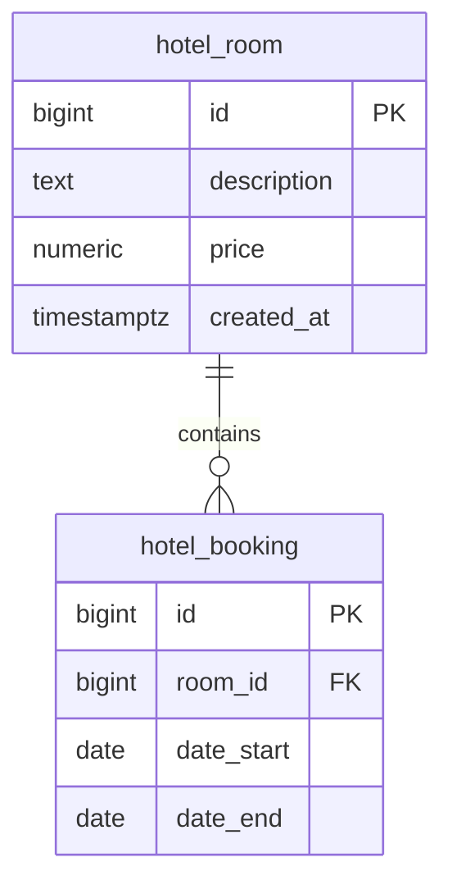
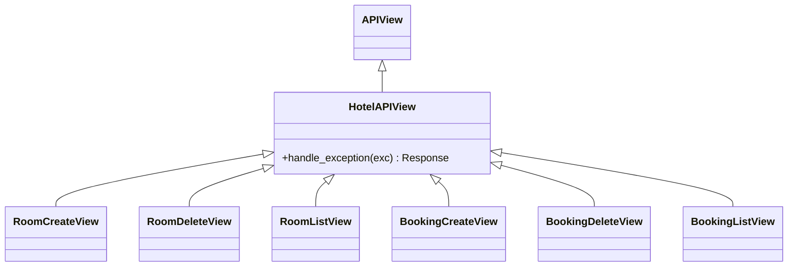

# Структурная модель

## Организация исходного кода

```text
Hotel_booking_service/
├── src/
│   ├── manage.py                 # административные команды Django
│   ├── config/
│   │   ├── environment.py        # типизированная конфигурация
│   │   ├── settings.py           # настройки Django и DRF
│   │   ├── urls.py               # корневые маршруты
│   │   ├── error_views.py        # JSON-обработчики 404 и 500
│   │   ├── wsgi.py               # точка входа Gunicorn
│   │   └── asgi.py               # ASGI-точка входа
│   └── hotel/
│       ├── apps.py               # конфигурация Django-приложения
│       ├── urls.py               # шесть маршрутов API
│       ├── views.py              # HTTP-обработчики
│       ├── serializers.py        # валидация и представление данных
│       ├── services.py           # операции записи
│       ├── selectors.py          # операции чтения
│       ├── models.py             # Room и Booking
│       ├── exceptions.py         # доменные ошибки
│       └── migrations/0001_initial.py
├── tests/                        # API, БД, конфигурация и конкуренция
├── docs/                         # эта документация
├── docker/entrypoint.sh          # миграции перед запуском сервера
├── scripts/wsl-check.sh          # проверка окружения WSL/Docker
├── .github/workflows/ci.yml      # автоматические проверки
├── docker-compose.yaml          # web, db и volume
├── Dockerfile
├── .env.example                 # образец конфигурации
├── pyproject.toml               # зависимости и настройки инструментов
├── poetry.lock                  # зафиксированные зависимости
└── Makefile                     # команды разработки
```

## Классы предметной области



Обе сущности наследуют `django.db.models.Model`. Номер может иметь ноль или много
броней; каждая бронь обязательно относится к одному номеру. Обратное отношение
доступно как `room.bookings`, идентификатор связанного номера — как `booking.room_id`.
Самостоятельной сущности клиента или гостиницы нет.

## Реляционная схема



Таблицы создаёт [начальная миграция](../src/hotel/migrations/0001_initial.py).
Диаграмма содержит предметные таблицы; стандартные таблицы установленных Django-приложений
не показаны. Все перечисленные поля обязательны на уровне `NOT NULL`.

| Таблица / поле | Тип и назначение | Правило |
|---|---|---|
| `hotel_room.id` | `bigint`, автоматически формируемый PK | В API называется `room_id` |
| `hotel_room.description` | `text`, описание номера | API обрезает крайние пробелы и запрещает пустое описание |
| `hotel_room.price` | `numeric(12,2)`, цена номера | БД требует `price > 0`; API допускает минимум `0.01`, максимум `9999999999.99` |
| `hotel_room.created_at` | `timestamp with time zone`, время создания | Django задаёт через `auto_now_add`; настройки времени — UTC |
| `hotel_booking.id` | `bigint`, автоматически формируемый PK | В API называется `booking_id` |
| `hotel_booking.room_id` | `bigint`, FK на `hotel_room.id` | Ссылка на существующий номер |
| `hotel_booking.date_start` | `date`, дата заезда | API принимает календарную дату `YYYY-MM-DD` |
| `hotel_booking.date_end` | `date`, дата выезда | Должна быть строго позже даты заезда |

Цена сериализуется в строку с двумя десятичными знаками. `room_id` не включается в
элемент ответа списка броней: номер уже задан параметром запроса. Публичные имена
`room_id` и `booking_id` сериализаторы сопоставляют полю модели `id`.

## Ограничения целостности

| Правило | Место реализации |
|---|---|
| Уникальность идентификатора и обязательность полей | PK и NOT NULL в PostgreSQL |
| Положительная цена | Сериализатор; CHECK `hotel_room_price_positive` |
| Конец проживания позже начала | Сериализатор; CHECK `hotel_booking_dates_ordered` |
| Непустое описание после удаления крайних пробелов | `RoomCreateSerializer`, отдельного CHECK в БД нет |
| Существование связанного номера | Сервис/селектор и внешний ключ в БД |
| Отсутствие пересечения броней | `create_booking` при включённой проверке, транзакция и блокировка номера |
| Удаление броней при удалении номера | Django ORM: `ForeignKey(..., on_delete=models.CASCADE)` |

`on_delete=models.CASCADE` описывает каскадное удаление средствами Django ORM.
Это не следует трактовать как объявление SQL `ON DELETE CASCADE`: прямое SQL-удаление
родительской строки не использует механизм удаления Django.

## Индексы и порядок выдачи

| Индекс | Поля | Связанный сценарий |
|---|---|---|
| `hotel_room_price_id_idx` | `price, id` | Сортировка номеров по цене с разрешением равенства по ID |
| `hotel_room_created_id_idx` | `created_at, id` | Сортировка номеров по времени создания и ID |
| `hotel_booking_room_date_idx` | `room_id, date_start, id` | Выборка броней номера с сортировкой по началу и ID |

Дополнительно Django создаёт индексы первичных ключей и индекс внешнего ключа
`Booking.room`. Конкретный план выполнения запроса выбирает PostgreSQL.
Для номеров `desc` меняет направление и основного поля, и ID; для броней оба поля
всегда сортируются по возрастанию. Общая сортировка в `Meta.ordering` не задана:
порядок явно устанавливают селекторы.

## Структура HTTP-классов



`HotelAPIView` задаёт свободный доступ и единое представление ошибок. Входные классы
`RoomCreateSerializer`, `RoomIdSerializer`, `RoomListQuerySerializer`,
`BookingCreateSerializer` и `BookingIdSerializer` наследуют DRF `Serializer`.
Выходные `RoomSerializer` и `BookingSerializer` наследуют `ModelSerializer`.
`StrictDateField` расширяет `DateField` проверкой точного формата строки.

`HotelDomainError` наследует `Exception`; его потомки обозначают отсутствие номера,
отсутствие брони и пересечение дат. Сервисный слой организован функциями, отдельные
классы репозиториев или сервисов в проекте не предусмотрены.
