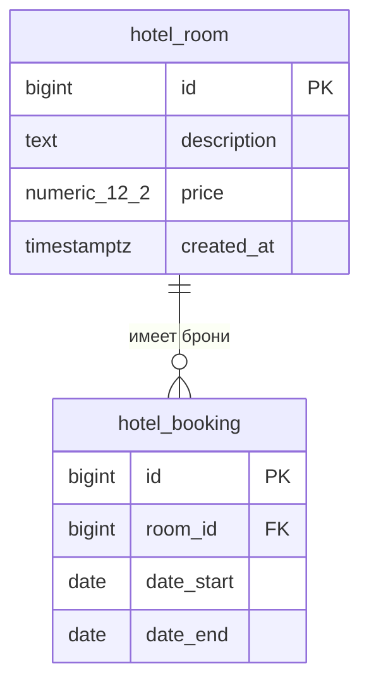

# Схема базы данных

Таблицы соответствуют миграции `hotel.0001_initial`. Все поля обязательны.

- `hotel_room.price` ограничено проверкой `price > 0`.
- `hotel_booking.date_end` должно быть позже `date_start`.
- `hotel_booking.room_id` ссылается на `hotel_room.id`; при удалении номера Django ORM удаляет его брони каскадно.
- Индексы: `(price, id)`, `(created_at, id)` для `hotel_room`; `(room_id, date_start, id)` для `hotel_booking`.
